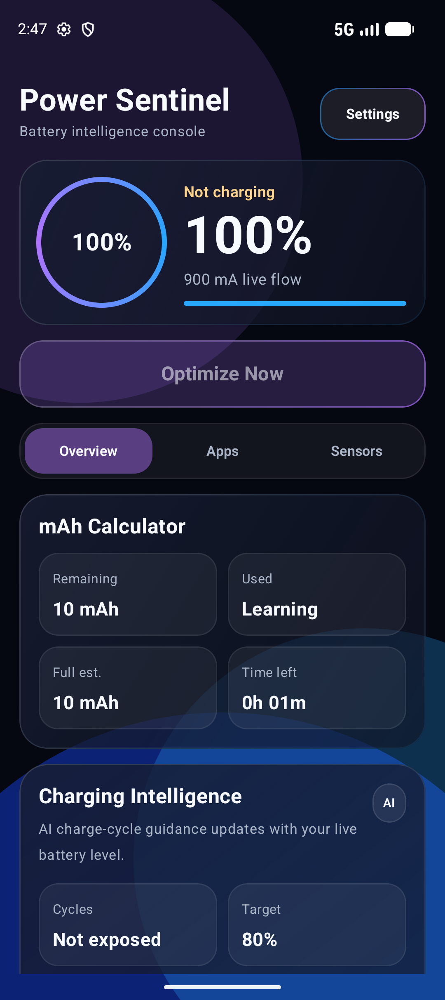
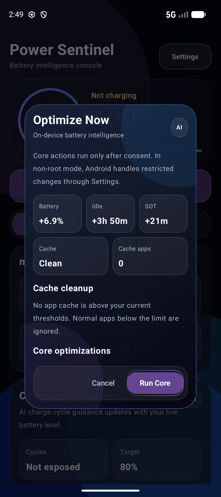
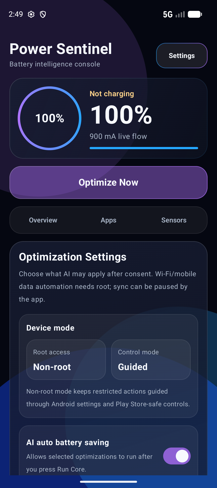
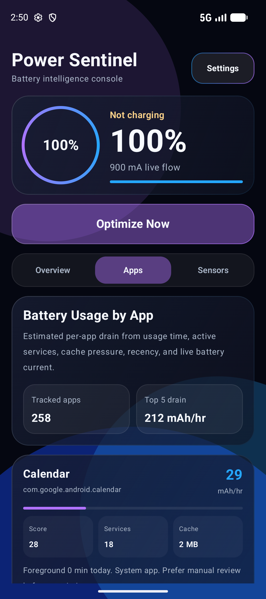
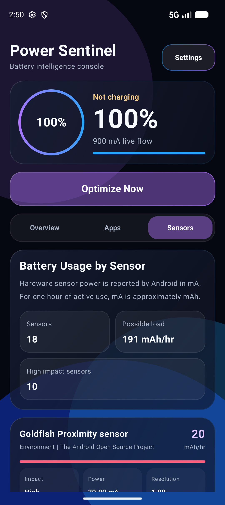

# Power Sentinel

Premium Android battery intelligence for users who want to understand what is draining their phone, what can actually be optimized, and what Android safely allows an app to do.

Power Sentinel combines live battery health, per-app drain estimates, per-sensor drain visibility, cache pressure detection, charging guidance, root-aware controls, and on-device optimization planning inside one dark blue-purple glass console.



## Version 2.2

Power Sentinel 2.2 is the device intelligence release. It focuses on phone-specific numbers instead of generic battery claims: live mA flow is validated, unreliable OEM readings are handled safely, app savings vary per app, cache impact is more honest, and charging advice now reacts to the user's current battery state.

<p align="center">
  
  
  
</p>

<p align="center">
  
  
</p>

## What Makes It Different

Most battery apps stop at charts. Power Sentinel tries to answer the next question:

> What should I do right now, and what could it save on this phone?

The app learns from local device signals such as usage access, foreground time, active services, cache size, battery flow, screen-off drain, radio state, sync state, display configuration, charging state, and sensor metadata. It then produces a consent-based optimization plan instead of generic tips.

## Core Features

- Premium dark glass UI with blue and purple energy accents.
- One-time onboarding for permissions, terms, and root/non-root mode.
- Live battery health console with mA flow, mAh calculator, health, voltage, temperature, and time estimate.
- Charging Intelligence card with cycle guidance, charge target, cycle cost, and OEM charging-limit detection where available.
- Per-app battery usage estimates in mAh/hr.
- Per-sensor battery usage estimates in mAh/hr using Android hardware sensor power metadata.
- AI Optimize Now panel with battery, idle time, SOT, cache, and cache-app impact.
- Cache cleanup intelligence with normal/social app thresholds.
- Settings for AI auto battery saving: Wi-Fi, mobile data, sync, and Bluetooth.
- Display analysis for resolution, refresh rate, and inferred high-refresh/adaptive panel behavior.
- Root-aware optimization actions with explicit consent.
- Play Store-safe non-root mode with guided Android settings handoff.

## AI Battery Intelligence

Power Sentinel uses on-device intelligence. No cloud model is required for the core plan.

The optimizer considers:

- App foreground usage and recency.
- Active service count and background pressure.
- Cache size and custom cache thresholds.
- Social app cache behavior.
- Battery capacity, percentage, charging state, and live current flow.
- Screen-off idle drain samples collected over time.
- Wi-Fi, mobile data, Bluetooth, GPS, and sync state.
- Display state, brightness context, and refresh-rate class.
- Root and Device Owner availability.

The numbers are designed to become more device-specific over time. Early estimates are provisional; after several days of screen-off samples, idle and SOT recommendations become more personalized for that phone.

## Live mA Flow

Android vendors do not expose battery current equally. Some phones report clean live current, while others return blocked or placeholder values.

Power Sentinel 2.2 handles that safely:

- Real current from Android `BatteryManager` is used when it looks reliable.
- Tiny placeholder values like `0`, `1`, or `2 mA` are ignored.
- If instant current is blocked, the app learns from charge-counter and battery-level movement over time.
- Until enough signal is available, the UI says `Learning live flow` instead of showing fake numbers.

## Optimize Now

The Optimize Now flow explains what it will do before it runs.

It shows:

- Estimated battery saved.
- Estimated extra idle time.
- Estimated extra screen-on time.
- Cache cleanup status.
- Core actions available on this device.
- Smart suggestions Android requires the user to confirm.

In root mode, supported actions can run directly after consent. In non-root mode, Power Sentinel stays Play Store-safe and opens the correct Android settings screen where the OS requires confirmation.


## Cache Cleanup Rules

Power Sentinel does not treat every small cache as a battery problem.

- Normal apps: cache below 50 MB is ignored by default.
- Social apps: cache below 100 MB is ignored by default.
- Both thresholds can be changed in Settings.
- Optimize Now reports whether cache cleanup was available, skipped, or completed.
- Battery impact is intentionally conservative because cache cleanup mostly frees storage unless an app is constantly rebuilding large cache.

## Charging Intelligence

The dashboard now includes AI charge-cycle guidance.

- Reads battery level and thermal state.
- Estimates how much of a charge cycle the next top-up costs.
- Suggests a daily target, usually around 80 percent unless heat or OEM settings imply a different target.
- Detects charging cycle count or charging limit only when the system exposes those properties.

## Per-App Battery Usage

The Apps tab estimates per-app drain from:

- Usage time.
- Active services.
- Cache pressure.
- Last-used recency.
- Live battery flow.
- System/user app context.


## Per-Sensor Battery Usage

The Sensors tab is one of Power Sentinel's main USPs. It reads Android sensor metadata and shows possible mAh/hr pressure for hardware sensors where the device reports power values.


## Capability Modes

Power Sentinel is honest about Android limits.

- Non-root mode: analysis, recommendations, cache visibility, sync control where allowed, and guided settings actions.
- Device Owner mode: managed-device controls where Android permits them.
- Root mode: stronger actions such as force-stop, cache trim, and system toggles where the device/ROM supports them.

## Android Reality Check

Android does not allow a normal Play Store app to silently force-stop other apps, disable hidden services, clear private app data, or toggle protected radios in the background. Power Sentinel is built around that boundary:

- It explains what is possible.
- It asks before acting.
- It keeps non-root actions policy-safe.
- It unlocks stronger actions only when root or managed-device capability is actually available.

## Build

Open this repository in Android Studio, sync Gradle, then run the `app` configuration on a device or emulator.

Debug APK:

```text
app/build/outputs/apk/debug/app-debug.apk
```

Release APK:

```text
app/build/outputs/apk/release/app-release-unsigned.apk
```

## Release Notes

See [CHANGELOG.md](CHANGELOG.md) for version history.
